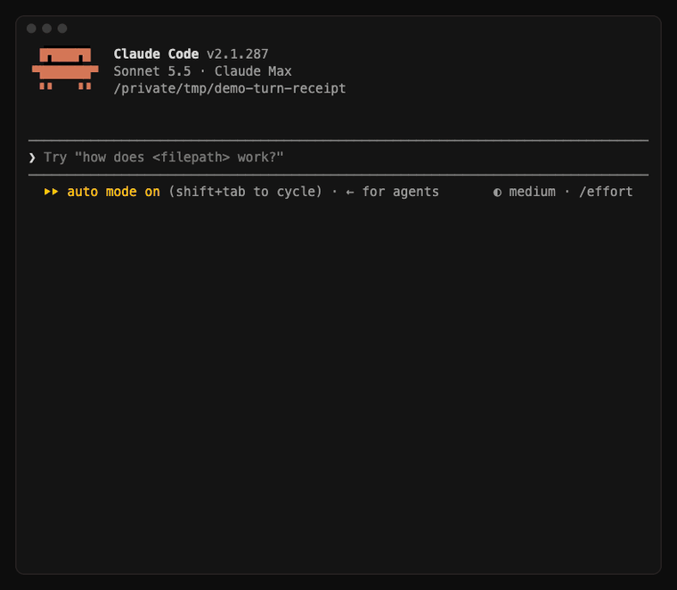
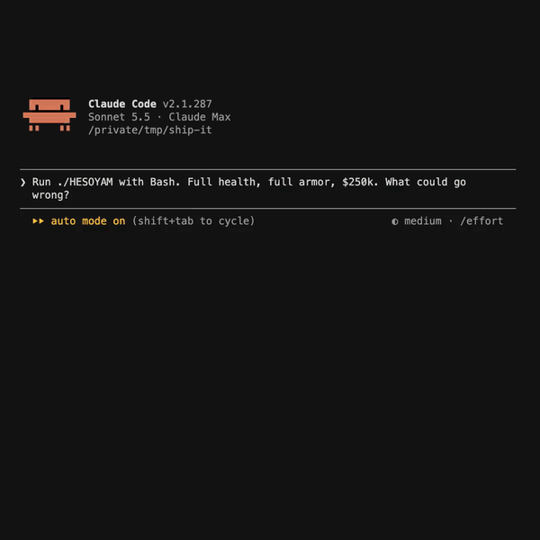

# cc-mods

Small mods for [Claude Code](https://code.claude.com). No build, no config: install one and it runs on its own.

## [turn-receipt](turn-receipt/)

At the end of every turn Claude prints a receipt: the files it touched, the commands it ran, the tokens it used and what the turn cost.



## [wasted](wasted/)

When a tool call fails, the spinner dies: the line drains to grey and **WASTED** fades in, in hand-drawn pixel lettering.



## Install

In a Claude Code session:

```
/plugin marketplace add roaringsoul404/cc-mods
/plugin install turn-receipt@roaringsoul
/plugin install wasted@roaringsoul
```

Or from your shell:

```bash
claude plugin marketplace add roaringsoul404/cc-mods
claude plugin install turn-receipt@roaringsoul
```

### Stay up to date

Updates are off by default for any marketplace that isn't Anthropic's. To get new versions on their own, open `/plugin` → **Marketplaces** → `roaringsoul` → **Enable auto-update**.

Or update by hand whenever you like:

```
/plugin marketplace update roaringsoul
```

### Try one without installing

```bash
git clone https://github.com/roaringsoul404/cc-mods
claude --plugin-dir ./cc-mods/turn-receipt
```

## If nothing shows up

Mods are an early Claude Code feature (2.1.287 at the time of writing), and Claude Code can switch them off remotely for a launch. Start with `--debug-file /tmp/mods.log`, then:

```bash
grep "@inline\|hooks module" /tmp/mods.log
```

`loaded` means the mod is on. `the rollout switch served off` means mods were off for that launch: restart and check again.

## License

[MIT](LICENSE) © Roaring Soul
